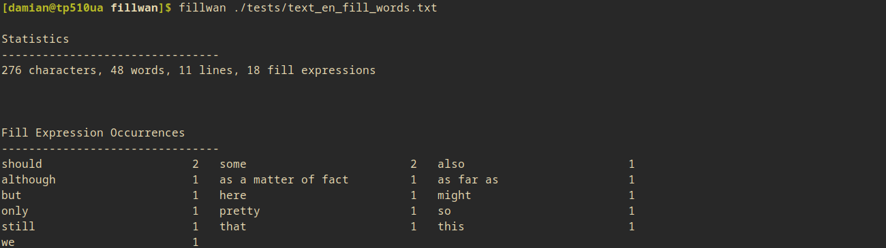
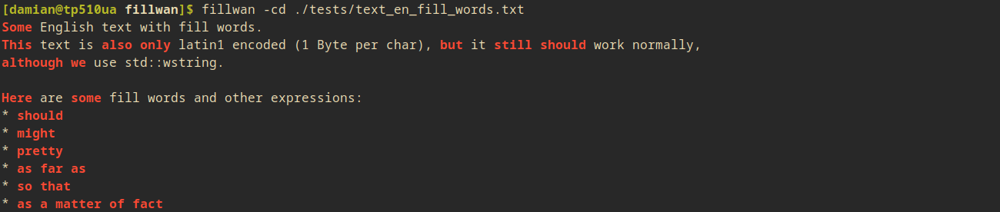

# fillwan 
## FILLWord ANalysis

This tool analyzes a given text for fill words and other potentially unwanted words and expressions in scientific writing.
Outputs statistics and a list of found words with occurrence count. With the ``-d`` option it dumps the original text with the expressions being highlighted.


### Analyzed Words/Expressions (English)

A list of some analyzed categories with examples can be found below.
All expressions are found in the [source file](src/words_en.hpp).

* first person perspective (I, my, we, our, ...)
* conjunctive (could, would, ...)
* transition words (but, therefore, ...)
* colloquial terms (okay, nice, stuff, ...)
* fill words (indeed, really, very, ...)
* weakening expressions (quite, most, probably, ...)
* words and adjectives with little meaning (good, right, thing, ...)
* commonly overused expression (be seen, is shown, for example, ...)


### Analysierte Wörter/Ausdrücke (German)

Eine Liste aller Ausdrücke befindet sich [im Quellcode](src/words_de.hpp).

* Personalpronomen (ich, mein, wir, uns, ...)
* Indefinitpronomen (man)
* Passivformen (wurde, werden, ...)
* Konjunktivformen (sei, wäre, könne, würde, ...)
* Füllwörter (auch, meist, wohl, ...)
* Konjunktionen und Satzverbindungen (außerdem, nichtsdestotrotz, im nächsten Schritt, ...)
* häufig überbenutzte Formulierungen ("zu sehen ist", "es ergibt sich", "in dieser Arbeit", ...)
* umgangssprachliche Formen (eh, halt, irgendwas, ...)
* ungenaue Adjektive oder Wörter mit wenig Aussagekraft (gut, schlecht, einigermaßen, oft, ...)

---
### Usage

The below program options are also displayed using the ``-h`` parameter.

```
usage: fillwan [options] [file]
reads from standard input if no file is provided

options:
-h | --help              display this help
-l | --lang (EN | DE)    language selection. English or German. Default: EN
-c | --color             enable colored output
-d | --dump              dump text with highlighted fill expressions
-a | --alpha             sort occurrence map alphabetically, not by count
```

For the following commands a Unix system including the ``grep``, ``cat``, and ``less`` utilities is assumed.

You can either pipe text into fillwan like:
```
cat text.txt | fillwan
```

Or load the text file directly:
```
fillwan text.txt
```

**Example 1**: Scroll interactively through the text with the expressions being highlighted:
```
cat text.txt | fillwan -cd | less -RN
```

**Example 2**: Scroll through all lines containing fill expressions, show line numbers from original text
```
cat text.txt | fillwan -d | grep --color=always -ne "<<[^>]\+>>" | less -R
```

---
### Screenshots

Default usage of fillwan, here showing statistics on a test text:




The following command instead dumps the text with the expressions highlighted:



---
### Building Instructions

Run the Makefile using ``make``.
This program requires a compiler supporting C++20.

Installation with ``sudo make install``.
